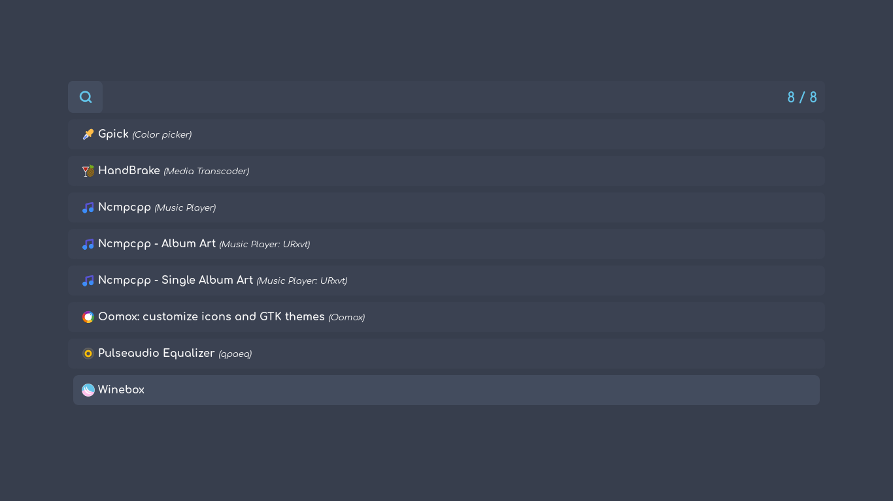
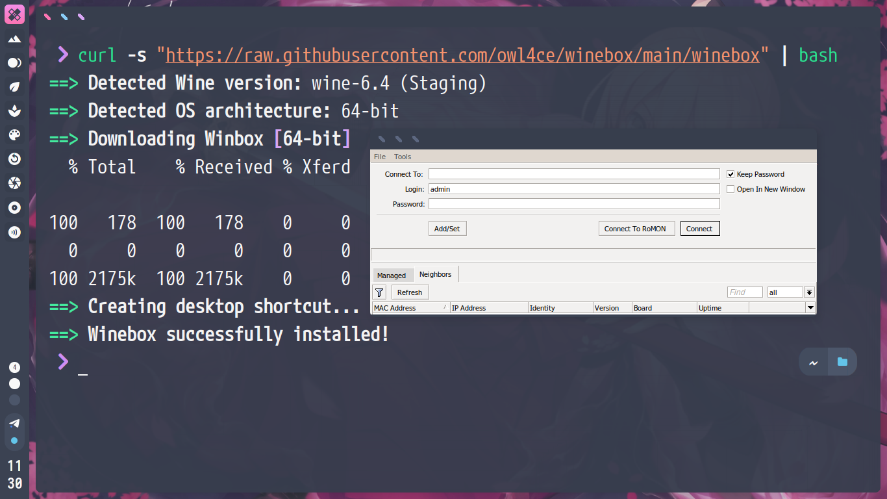

<br>
<p align="center"><a name="top" href="#dependencies-"></a></p>

##  
### Dependencies 
`bash` `curl` `wine`

##  
### Install
```bash
$ curl -s "https://raw.githubusercontent.com/owl4ce/winebox/main/winebox" | bash
```

> :heavy_check_mark: **wine-6.4 (Staging)**

##  
### Uninstall
```bash
$ curl -s "https://raw.githubusercontent.com/owl4ce/winebox/main/winebox" | bash -s -- -u
```

##  

<p align="center"></p>

<p align="center"></p>

##  

### <p align="center"><a href="https://www.deviantart.com/aerilius/art/Ubuntu-Light-Themes-12-10-327631977"><kbd>Ubuntu Light Themes 12.10</kbd></a></p>
