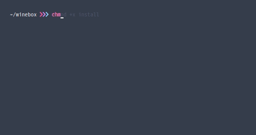
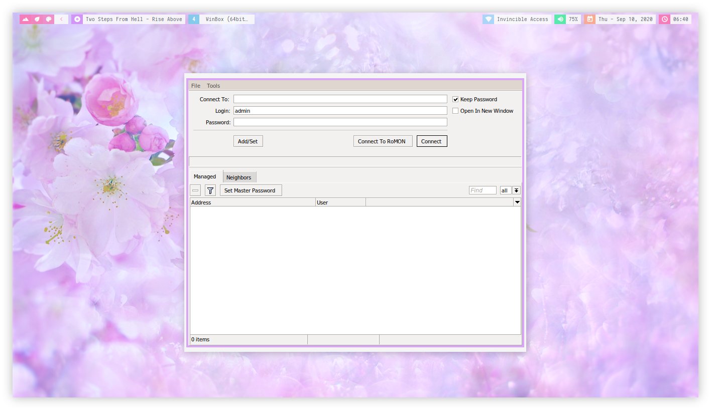

<p align="center"><a name="top" href="#winebox---winbox-installer-for-linux"></a></p>

<br>

<h2 align="center">Winebox - Winbox Installer for Linux</h2>

<a href="./assets/preview.gif"></a>

<p align="center">Clone this repository</p>

```bash
git clone https://github.com/owl4ce/winebox.git
```
Or download it as a zip. After that, execute the [install.sh](./install.sh) program.

> :heavy_check_mark: Successfully tested on **wine-5.16 (Staging)**

---



<a href="https://www.deviantart.com/aerilius/art/Ubuntu-Light-Themes-12-10-327631977"><p align="center">Ubuntu Light Themes 12.10</p><a>
