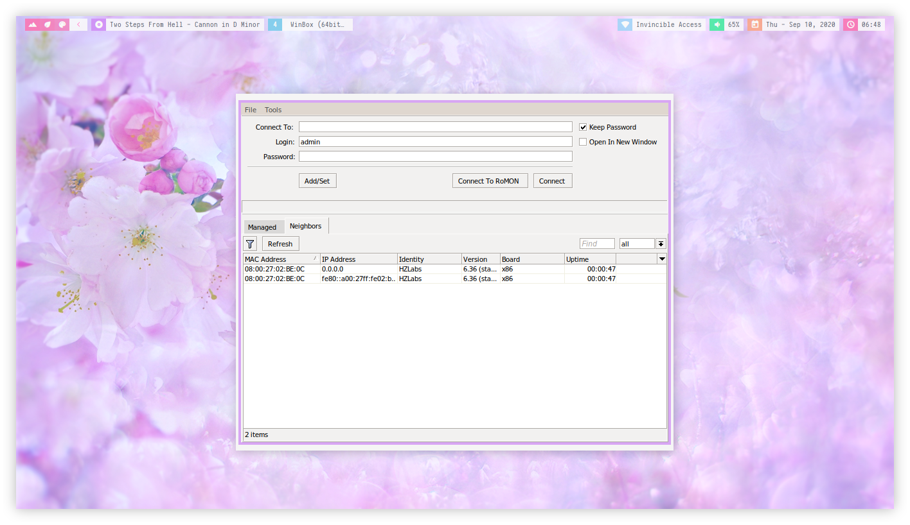
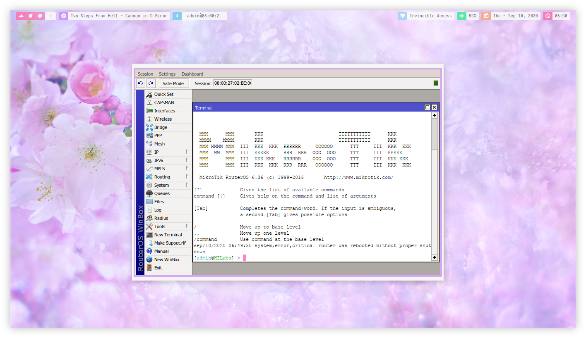

<p align="center"><a name="top" href="#satellite-winebox-a-winbox-installer-for-linux-run-over-wine"></a></p>

<br>

<h2 align="center">:satellite: Winebox: A Winbox installer for Linux run over WINE</h2>

<a href="./assets/preview.gif"></a>

Clone this repository
```bash
git clone https://github.com/owl4ce/winebox.git
```
or download it as a zip. After that, execute the [install.sh](./install.sh) program as **non-root** user.

> :heavy_check_mark: Successfully tested at **wine-5.16 (Staging)**

---




<a href="https://www.deviantart.com/aerilius/art/Ubuntu-Light-Themes-12-10-327631977"><p align="center">Ubuntu Light Themes 12.10</p><a>
