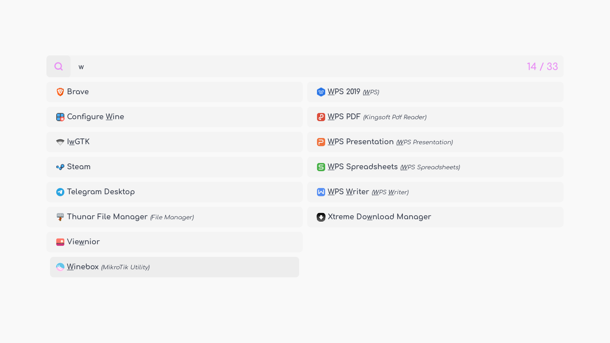

<p align="center"><a name="top" href="#winebox---winbox-installer-for-linux"></a></p>

<br>

<h2 align="center">Winebox - Winbox Installer for Linux</h2>

<a href="#winebox---winbox-installer-for-linux"></a>

## Dependencies 
`bash` `git` `wget` `wine`

## Install
Clone this repository, then run `install.sh`.
```bash
git clone https://github.com/owl4ce/winebox.git
./winebox/install.sh
```

> :heavy_check_mark: Successfully tested on **wine-5.22 (Staging)**

<br>




## <a href="https://www.deviantart.com/aerilius/art/Ubuntu-Light-Themes-12-10-327631977"><p align="center">Ubuntu Light Themes 12.10</p></a>

## Uninstall
```bash
./install.sh --uninstall
```
